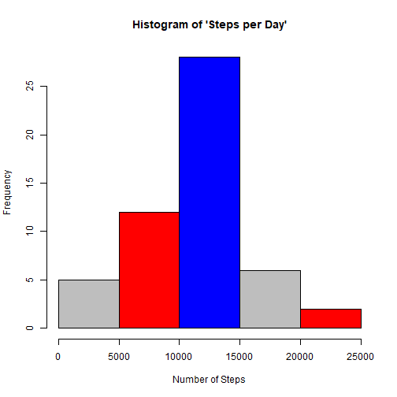
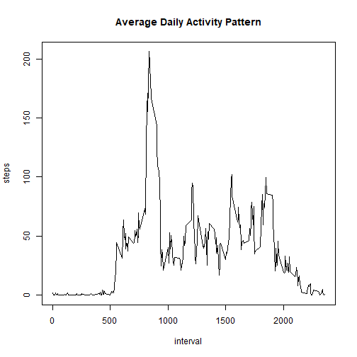
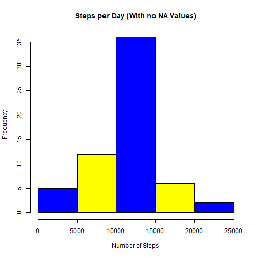

Peer Graded Assignment 1
================================================================================


## Loading and preprocessing the data

```r
activityDat <- read.csv("activity.csv", header = TRUE)
```

## What is mean total number of steps taken per day?

1. Calculate the total number of steps taken per day


```r
StepsPerDay <- tapply(activityDat$steps, activityDat$date, sum)
StepsPerDay
```

```
## 2012-10-01 2012-10-02 2012-10-03 2012-10-04 2012-10-05 2012-10-06 2012-10-07 2012-10-08 2012-10-09 2012-10-10 
##         NA        126      11352      12116      13294      15420      11015         NA      12811       9900 
## 2012-10-11 2012-10-12 2012-10-13 2012-10-14 2012-10-15 2012-10-16 2012-10-17 2012-10-18 2012-10-19 2012-10-20 
##      10304      17382      12426      15098      10139      15084      13452      10056      11829      10395 
## 2012-10-21 2012-10-22 2012-10-23 2012-10-24 2012-10-25 2012-10-26 2012-10-27 2012-10-28 2012-10-29 2012-10-30 
##       8821      13460       8918       8355       2492       6778      10119      11458       5018       9819 
## 2012-10-31 2012-11-01 2012-11-02 2012-11-03 2012-11-04 2012-11-05 2012-11-06 2012-11-07 2012-11-08 2012-11-09 
##      15414         NA      10600      10571         NA      10439       8334      12883       3219         NA 
## 2012-11-10 2012-11-11 2012-11-12 2012-11-13 2012-11-14 2012-11-15 2012-11-16 2012-11-17 2012-11-18 2012-11-19 
##         NA      12608      10765       7336         NA         41       5441      14339      15110       8841 
## 2012-11-20 2012-11-21 2012-11-22 2012-11-23 2012-11-24 2012-11-25 2012-11-26 2012-11-27 2012-11-28 2012-11-29 
##       4472      12787      20427      21194      14478      11834      11162      13646      10183       7047 
## 2012-11-30 
##         NA
```

2. If you do not understand the difference between a histogram and a barplot, research the difference between them. Make a histogram of the total number of steps taken each day. 


```r
hist(StepsPerDay, xlab = "Number of Steps", main = "Histogram of 'Steps per Day'", 
     col=c("grey", "red", "blue"))
```



3. Calculate and report the mean and median of the total number of steps taken per day

```r
MeanStepsPerDay <- mean(StepsPerDay, na.rm = TRUE)
MedianStepsPerDay <- median(StepsPerDay, na.rm = TRUE)
MeanStepsPerDay
```

```
## [1] 10766.19
```
Above stated is the Mean of total steps per day  

Below is the Median of total steps per day -  
## What is the average daily activity pattern?

```r
MedianStepsPerDay
```

```
## [1] 10765
```

1. Make a time series plot (i.e. 𝚝𝚢𝚙𝚎 = "𝚕") of the 5-minute interval (x-axis) and the average number of steps taken, averaged across all days (y-axis)
  

```r
StepsPerInterval<-aggregate(steps~interval, data=activityDat, mean, na.rm=TRUE)

plot(steps~interval, data=StepsPerInterval, type="l",
          main = "Average Daily Activity Pattern")
```



2. Which 5-minute interval, on average across all the days in the dataset, contains the maximum number of steps?


```r
intervalWithMaxSteps <- StepsPerInterval[which.max(StepsPerInterval$steps),]$interval
intervalWithMaxSteps
```

```
## [1] 835
```

## Imputing missing values

1. Calculate and report the total number of missing values in the dataset (i.e. the total number of rows with 𝙽𝙰s)


```r
NA.vals <- sum(is.na(activityDat$steps))
NA.vals
```

```
## [1] 2304
```

2. Devise a strategy for filling in all of the missing values in the dataset. The strategy does not need to be sophisticated. For example, you could use the mean/median for that day, or the mean for that 5-minute interval, etc.


```r
#Get the mean
StepsPerInterval <- tapply(activityDat$steps, activityDat$interval, mean, na.rm = TRUE)

# split activity data by interval
activityDat.split <- split(activityDat, activityDat$interval)

# fill in missing data for each interval
for(i in 1:length(activityDat.split)){
    activityDat.split[[i]]$steps[is.na(activityDat.split[[i]]$steps)] <- StepsPerInterval[i]
}
```

3. Create a new dataset that is equal to the original dataset but with the missing data filled in.


```r
activityDat_imputed <- do.call("rbind", activityDat.split)
#Ordering the new dataset
activityDat_imputed <- activityDat_imputed[order(activityDat_imputed$date) ,]
```

4. Make a histogram of the total number of steps taken each day and calculate and report the mean and median total number of steps taken per day. Do these values differ from the estimates from the first part of the assignment? What is the impact of imputing missing data on the estimates of the total daily number of steps?


```r
# histogram for total number of steps taken per day
StepsPerDay_imputed <- tapply(activityDat_imputed$steps, activityDat_imputed$date, sum)
hist(StepsPerDay_imputed, xlab = "Number of Steps", main = "Steps per Day (With no NA Values)", 
     col = c("Blue","Yellow"))
```



```r
# mean and median total number of steps taken per day
MeanPerDay_imputed <- mean(StepsPerDay_imputed, na.rm = TRUE)
MedianPerDay_imputed <- median(StepsPerDay_imputed, na.rm = TRUE)
MeanPerDay_imputed
```

```
## [1] 10766.19
```
Above stated is the Mean of total steps per day  

Below is the Median of total steps per day -  

```r
MedianPerDay_imputed
```

```
## [1] 10766.19
```
The median value differs from the first part.  

## Are there differences in activity patterns between weekdays and weekends?

1. Create a new factor variable in the dataset with two levels – “weekday” and “weekend” indicating whether a given date is a weekday or weekend day.


```r
activityDat_imputed$date <- as.Date(strptime(activityDat_imputed$date, format="%Y-%m-%d"))
activityDat_imputed$day <- weekdays(activityDat_imputed$date)
for (i in 1:nrow(activityDat_imputed)) {
    if (activityDat_imputed[i,]$day %in% c("Saturday","Sunday")) {
        activityDat_imputed[i,]$day<-"weekend"
    }
    else{
        activityDat_imputed[i,]$day<-"weekday"
    }
}
stepsByDay <- aggregate(activityDat_imputed$steps ~ activityDat_imputed$interval + 
                        activityDat_imputed$day, activityDat_imputed, mean)
```

2. Make a panel plot containing a time series plot (i.e. 𝚝𝚢𝚙𝚎 = "𝚕") of the 5-minute interval (x-axis) and the average number of steps taken, averaged across all weekday days or weekend days (y-axis). See the README file in the GitHub repository to see an example of what this plot should look like using simulated data.


```r
names(stepsByDay) <- c("interval", "day", "steps")
library(lattice)

xyplot(steps ~ interval | day, stepsByDay, type = "l", layout = c(1, 2), 
    xlab = "Interval", ylab = "Number of steps")
```


